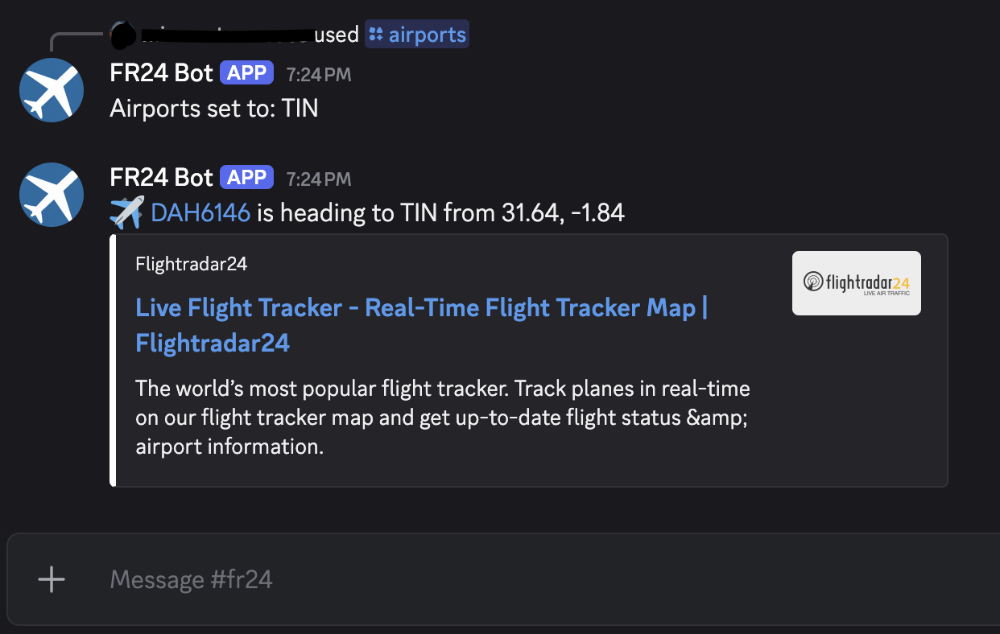

# FR24 Airport Alerts via Discord

This script will check every five minutes for flights going to the airport you specfied, and if there are any it will send you a notification. It can be controlled via Discord slash commands, which are:

*For each command, type `/` and then the name of the command in your channel.*

| Command | Format | Description |
| ---- | ----- | ----- |
| `Airports` | `FNJ` or `FNJ, MCM` | This specifies which airports you want the script to look for. Any input overwrites any old input. Multiple airports can be specified by putting a comma and a space between them. |
| `Start` | `1:00pm` or `8:00am` | The script only works during a specified time period, by default 9:00 am to 10:00 pm EST. The `Start` command specifies the Start of that time period. Input all times in EST. |
| `End` | `1:00pm` or `8:00am` | Same as above, but this is the end time |
| `Debug` | `On` or `Off` | When debug is on, the script will send a "no aircraft found" message if no aircraft are found. Off by default, good for troubleshooting. |
| `Script` | `On` or `Off` | This turns the whole thing on or off indefinitely. The API will not be queried when Script is set to Off |
| `Override` | `On` or `Off` | The script automatically stops querying when you've reached 300 aircraft for the day. This number roughly translates to the number of aircraft you can pull per day and still be under the basic tier credit limit. By setting Override to On, that limit is ignored for the rest of the day |
| `Info` | n/a | Run this to see what everything is set to and how many aircraft you've pulled today or this month (numbers are reset every time you restart the script)|

## Vague Instructions

*Hopefully I'll eventually get to fleshing this out, but for the time being, this will get you started*

You will have to sign up for a FR24 API account, for which the basic tier is $9/mo. This is separate from the FR24 Premium account. [Set up your FR24 API account here](https://fr24api.flightradar24.com/).

You will need to set up a Discord bot. [Set up your Discord bot here](https://discord.com/developers/applications).

You will need the channel ID of the channel where the messages should be sent. It'll have to be in a server that you have permission to allow new members (the bot) into, so make it your own private discord. Getting the channel ID is as simple as turning on developer mode in Discord and then copying it from the channel overflow menu.

Lastly, you will need access to a computer where the script can run 24/7. I set this up as a service on a Raspberry Pi, but it could be done on AWS or even your main computer if you don't mind leaving that on all the time.

## PSA

Don't be a dummy. This script allows anyone with access to the channel where the bot has been invited to send strings back to your computer. This opens your computer up to the whims of bad actors. Don't add this bot into any public servers.
